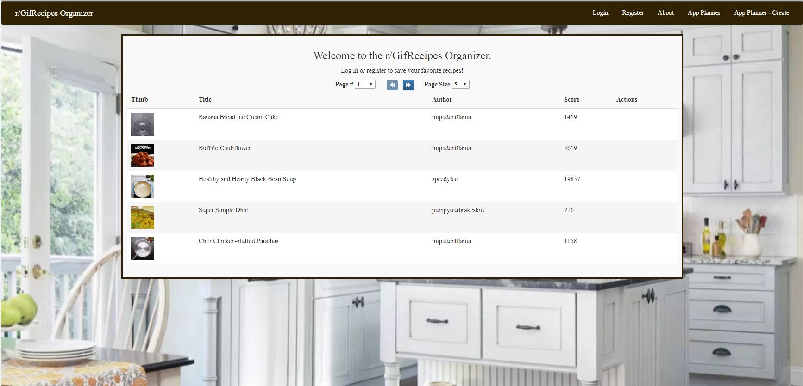
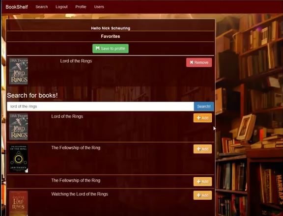
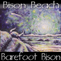
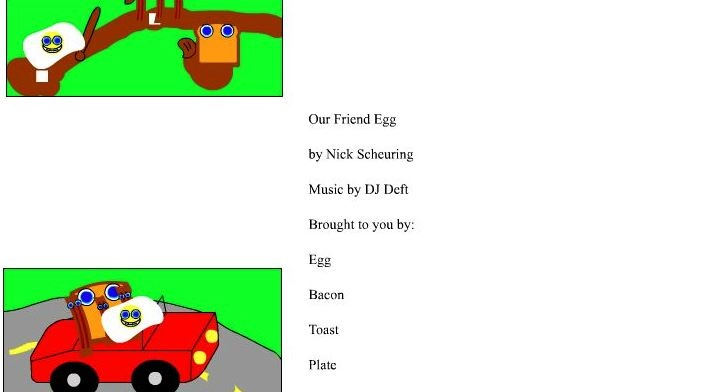
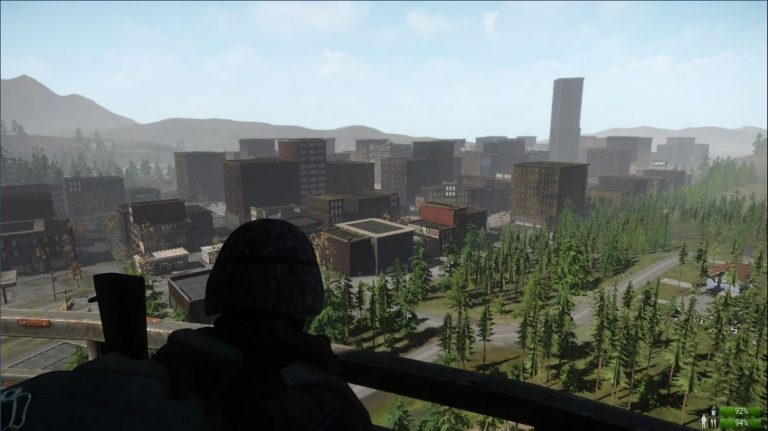

## about

I am deeply interested in creation.

Art and Engineering both consist of the formulation of an idea, the abstract, and the construction of a new reality where the abstract takes form.

Both music and technology retain a layer of abstraction, yet clearly exist, have a use, and affect the world we inhabit.

I love seeing abstraction become real.

I also enjoy gaming, especially survival and strategy games.

## portfolio

### GifRecipes Organizer

2017

MEAN application to search and store gif recipes posted to r/GifRecipes.

* Python script scrapes posts and the node app uses scraped data for users
* Deployed on AWS, using Nginx as a reverse proxy for node apps
* Deployment and process management using pm2
* Jasmine and Travis CI for testing and continuous integration

[GitHub](https://github.com/nscheu/aws-reddit-recipes)

[Visit Application](http://gifrecipes.nickscheuring.com/)

### Bookshelf

2015

MEAN application to search and store books using the Google Books Api. Originally deployed to OpenShift [Removed]

[GitHub](https://github.com/nscheu/cs3200)

### MIE Lab Database System

2015

Northeastern University

College of Engineering Mechanical and Industrial Engineering Lab

Developed and designed an inventory tracking system for Northeastern University’s College of Engineering Mechanical and Industrial Engineering Lab using PHP, MySQL, HTML5, and Bootstrap/CSS. Developed and designed a database and access system to track and store inventory of computer systems belonging to the MIE Lab.

### LAMP Social Networking Site

2014

Basic social networking site using WAMP Stack.

### Barefoot Bison

2003-2009

Band & Technologies

* [Cover art seen above] Painting by Jim Hoell
* Graphic design of logos, t-shirts, and merchandise.
* Webmaster
* Musician

Project leader for all phases of CD production including:

* August 2006: Release of Barefoot Bison : Bison Beach CD.
* Online store launched 9/1/2006.
* Building, budgeting and purchasing of studio equipment and facilities
* Sound engineering and production
* CD graphic design and typography
* Building the online store integrating PayPal shopping with Barefoot Bison fourth generation site.

[Visit Site Archive](http://www.nickscheuring.com/old_sites/bfb_sites/old_sites/4/public_html/)

### Flash Animation Mini Web Series

2003

Created the ‘Our Friend Egg’ and ‘Steven the Monkey’ Mini Web Episodes using Macromedia Flash. Integrated green screen in a novel way to blend digital photography with Flash animation.

## Education

Bachelor of Science in Computer Science 2017

Northeastern University College of Computer and Information Science

Boston, MA

 
Computer Science Transfer 2013

North Shore Community College

Danvers, MA

## Experience

### Application Development Officer

Feb 2018 – Present

Fund Administration Platform

State Street Corporation

Greater Boston Area, MA

* Backend Development, Upgrade, and Deployment of Enterprise Reconciliation Applications including SmartStream Technology TLM using Java, C++, Python, *NIX Shells,  Oracle SQL/PLSQL, and DataStage  in a Kanban Environment
* Migrated and Improved Development Team Process from ClearCase and Ad Hoc Build Process to GitHub, Artifactory, Rational Team Concert, Jenkins, CloudBees, and State Street Cloud or UrbanCode Deploy Process
* Trained Development Team in and Created Process Documentation for Git, Artifactory, RTC, UrbanCode
* Created Technical Proof of Concept Models using Apache Kafka for Strategic Planning Purposes
* Created Proof of Concept Models to Showcase Solutions to Business and Technical Requirements
* Daily Interaction with Business Team/Product Customers for Requirements Planning and Assessments
* Performed and Created Performance Tuning, Improvement, Balancing, and Usability Improvements

### Java Developer

Oct 2017 – Feb 2018

Time Customer Service

Tampa, FL

* Developed Subscription Page Generators for all Time Inc Branded Magazines
* Daily Interaction with Business Team for Requirements Planning and Assessments
* Short term position due to Meredith Purchase & Location Closure

### Developer Co-op/Contractor

July 2015 – Jan 2016

June 2016 – Sept 2016

Fund Administration Platform

State Street Corporation

Greater Boston Area, MA

* Development of financial cloud application using KendoUI, JQuery, JS, Java Services over Oracle in an Agile Environment
* Created Proof of Concept Models to Showcase Solutions to Business and Technical Requirements
* Daily Interaction with Business Team/Product Customers for Requirements Planning and Assessments
* Performed and Created Performance Tuning, Improvement, Balancing, and Usability Improvements

### DevOps Engineer Co-op

July 2014 – Jan 2015

Verizon Enterprise Cloud

Verizon Terremark

Lowell, MA

* Systems Administration of Verizon Cloud Compute
* Provisioning and Upgrades of Production and Staging Data Centers
* Cross-functional role working with developers to respond to system events
* Confluence Ticketing gatekeeper for DevOps team (Jira, SDP, Zendesk)
* Customer facing POC designer used in planning and implementing multi-million dollar contract solutions
* Developed system monitoring, automation, and maintenance tools.

## Gaming

I like games like Rust, Miscreated, The Forest, 7 Days to Die, Total War

